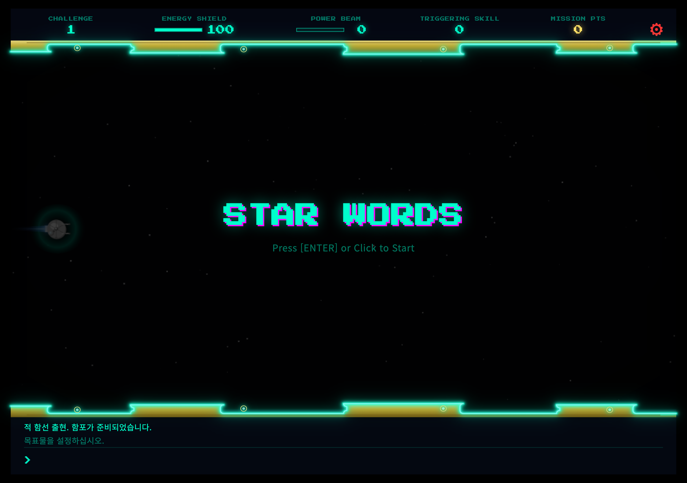
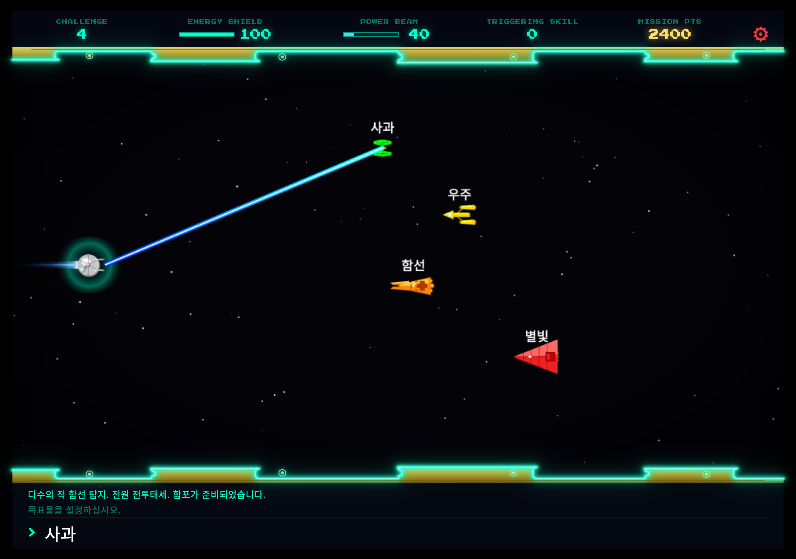
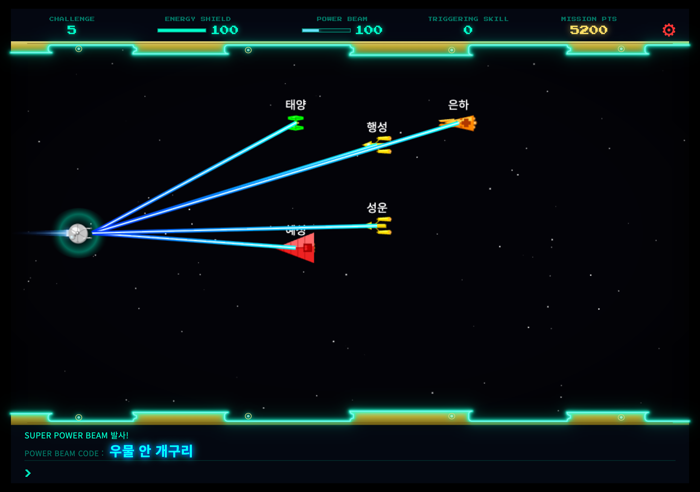
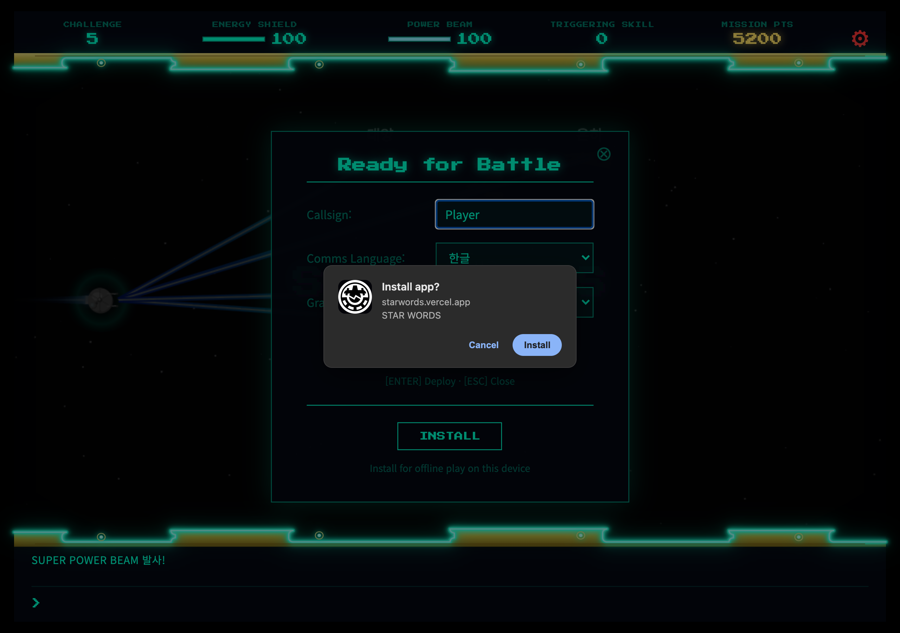

# STAR WORDS

우주 테마 슈팅과 타자 연습을 결합한 브라우저 게임입니다. 적 함선 위에 표시된 단어를 입력해 함포로 격추하고, 15개 챌린지를 돌파하세요.

## 플레이

**[https://starwords.vercel.app/](https://starwords.vercel.app/)**

---

## 1. 특징

- **우주 슈팅 + 타자 연습** — Canvas 2D로 구현된 레트로 SF 조종석 UI에서 단어를 입력해 적을 격추합니다.
- **초등 필수어휘** — 한글은 학년(Grade 1~6)별 필수어휘, 영어는 Level 1~10 어휘로 출제됩니다. 챌린지가 오를수록 단어가 누적되어 점점 어려워집니다.
- **4종 적 함선** — 타이파이터, Y-wing, 아퀴텐스, 스타디스트로이어가 각각 다른 이동·공격 패턴(미사일, 레이저)을 사용합니다.
- **레인 출현** — 적 함선은 가로 레인 슬롯에 배치되어 겹치지 않고 등장하며, 격추 후 약 1초 뒤에 다음 함선이 출현합니다.
- **ENERGY SHIELD** — 미사일·레이저에 피격되면 실드가 감소합니다. 0이 되면 게임 오버입니다.
- **POWER BEAM** — 적을 명중할 때마다 충전(+10)되며, 100%가 되면 발사 코드(속담·관용구)를 입력해 화면의 모든 적을 한 번에 격추할 수 있습니다.
- **회피 조작** — 화살표 키(↑/↓)로 함선을 이동해 미사일을 피할 수 있습니다.
- **TRIGGERING SKILL** — 타이핑 속도(타/분)를 실시간으로 측정합니다. 게임 오버 시 스킬 보너스가 최종 점수에 반영됩니다.
- **MISSION POINTS & TOP 10** — 격추·빔 발사로 점수를 획득하고, 로컬 저장소에 TOP 10 기록이 남습니다.
- **한글/영어 지원** — 콜사인, 통신 언어(한글·English), 한글 선택 시 학년(Grade)을 설정할 수 있습니다.
- **일시정지** — 창 포커스를 잃거나 탭을 전환하면 자동으로 일시정지됩니다.

---

## 2. 스크린샷

### 시작 화면

### 타이핑으로 공격

### POWER BEAM 다수 격추

### PWA 설치

---

## 3. 게임진행방법

### 시작하기

1. 타이틀 화면에서 **[ENTER]** 키를 누르거나 화면을 클릭합니다.
2. **Ready for Battle** 창에서 콜사인(Callsign)과 통신 언어를 설정한 뒤 **Deploy**를 누릅니다.
   - **한글(ko)**을 선택하면 **Grade(학년, 1~6)** 항목이 나타나며, 선택한 학년의 초등 필수어휘가 출제됩니다.
   - **English(en)**를 선택하면 Grade 항목이 숨겨지고 영어 어휘가 출제됩니다.
3. **3 → 2 → 1** 카운트다운 후 **CHALLENGE 1**이 시작됩니다.

### 기본 조작

| 입력 | 동작 |
|------|------|
| 단어 입력 + **ENTER** | 적 함선 위 단어와 일치하면 함포 발사 |
| **↑ / ↓** | 함선 상하 이동 (미사일 회피) |
| **ENTER** (일시정지 중) | 게임 재개 |
| ⚙ (설정) | 콜사인·언어·학년(Grade) 변경 |

### 출제 단어 (어휘 사전)

- 단어 데이터는 초등 필수어휘 권장 낱말목록을 기반으로 만든 `data/ko.js`, `data/en.js` 입니다.
- 한글은 **1~6학년**, 각 학년은 **Level 1~10**으로 구성되며, 영어는 학년 구분 없이 **Level 1~10**을 사용합니다.
- **누적 출제 방식** — `CHALLENGE N`은 `Level 1 ~ N`을 누적한 단어 풀에서 출제됩니다. 즉 챌린지가 올라갈수록 이전 레벨 단어에 새 레벨 단어가 더해져 점점 어려워집니다.
- `CHALLENGE 11 ~ 15`는 선택한 학년(또는 영어)의 **전체 Level(1~10)** 단어를 사용합니다.
- **POWER BEAM CODE**는 선택한 학년(또는 영어)의 **속담·관용구**에서 무작위로 출제됩니다.
- 단어를 바꿀 때는 `data/ko.js`, `data/en.js` 를 직접 수정하면 됩니다.

### 전투 흐름

1. 화면에 등장하는 적 함선 위의 **단어**를 하단 콘솔에 입력하고 **ENTER**를 누릅니다.
2. 단어가 정확히 일치하면 함포가 발사되어 적이 격추됩니다. (동일 단어 적이 여러 척이면 모두 명중 대상)
3. 오타나 없는 단어를 입력하면 POWER BEAM 충전이 **-10** 감소합니다.
4. 적 함선은 미사일·레이저를 발사합니다. 가까이 오면 콘솔에 경고가 표시되니 화살표 키로 회피하세요.
5. 적을 격추하면 약 **1초** 뒤에 다음 함선이 화면 오른쪽에서 출현합니다.

### POWER BEAM

- 적을 명중할 때마다 POWER BEAM 게이지가 **+10** 충전됩니다.
- 게이지가 **100%**가 되면 발사 코드 입력 모드로 전환됩니다.
- 콘솔에 표시된 **POWER BEAM CODE**(한글 속담·관용구 또는 영어 속담·관용어)를 정확히 입력하면 화면의 모든 적이 격추됩니다. (**+1000 MISSION PTS**)
- 코드 입력에 실패하면 POWER BEAM이 방전되고 일반 전투 모드로 돌아갑니다.

### 챌린지 클리어 & 게임 오버

- 각 챌린지에서 **챌린지 번호 × 10**척의 적을 격추하면 클리어합니다. (예: CHALLENGE 3 → 30척)
- 챌린지가 올라갈수록 동시에 등장하는 적 수가 늘어납니다. (최대 **CHALLENGE 15**)
- **ENERGY SHIELD**가 0이 되면 게임 오버입니다.

### 점수 계산

| 항목 | 점수 |
|------|------|
| 적 격추 1척 | +100 MISSION PTS |
| POWER BEAM 발사 1회 | +1000 MISSION PTS |
| 최종 점수 | MISSION PTS + (TRIGGERING SKILL × 도달 챌린지) |

---

## 저장소

- GitHub: [mcnorton/starwords](https://github.com/mcnorton/starwords)
- 배포: [https://starwords.vercel.app/](https://starwords.vercel.app/)
